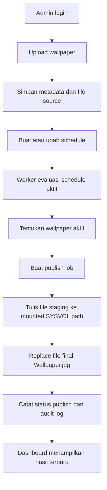

## 1. Gambaran Produk
Wallpaper Scheduler adalah aplikasi web full-stack berbasis TypeScript untuk upload wallpaper, menjadwalkan aktivasi berdasarkan tanggal dan jam, lalu mem-publish wallpaper aktif sebagai `Wallpaper.jpg` ke `SYSVOL` melalui CIFS mount pada host Ubuntu.
- Produk ini ditujukan untuk tim IT agar penggantian wallpaper domain menjadi terpusat, terjadwal, dan bisa diaudit.
- Nilai utama produk adalah menghilangkan proses manual rename-copy file serta memberi visibilitas publish status dan riwayat perubahan.

## 2. Fitur Inti

### 2.1 Peran Pengguna
| Peran | Metode Registrasi | Hak Akses Inti |
|------|-------------------|----------------|
| Admin | Dibuat manual di sistem | Kelola user, wallpaper, schedule, konfigurasi, manual publish, audit |
| Operator | Dibuat manual di sistem | Login, upload wallpaper, buat/edit schedule, lihat status publish |

### 2.2 Modul Fitur
1. **Halaman Login**: autentikasi lokal untuk admin dan operator.
2. **Dashboard**: ringkasan wallpaper aktif, next schedule, last publish, failed jobs, dan target path.
3. **Halaman Wallpaper**: upload wallpaper, preview, metadata, status arsip/aktif.
4. **Halaman Schedule**: create, edit, enable/disable, hapus schedule, dan warning konflik.
5. **Halaman Publish & Audit**: manual publish, histori publish job, dan audit log.
6. **Halaman Konfigurasi**: timezone default, retry policy, fallback wallpaper, dan target publish path read-only atau controlled edit untuk admin.

### 2.3 Detail Halaman
| Nama Halaman | Nama Modul | Deskripsi Fitur |
|--------------|------------|-----------------|
| Login | Form autentikasi | Login email dan password, validasi error state |
| Dashboard | Status cards | Menampilkan active wallpaper, next schedule, last publish status, scheduler heartbeat |
| Dashboard | Timeline ringkas | Menampilkan jadwal terdekat dan status enabled |
| Wallpaper | Upload panel | Upload file gambar, validasi file, preview dan metadata |
| Wallpaper | Daftar wallpaper | Filter, status, ukuran, checksum, aksi edit dan archive |
| Schedule | Form schedule | Pilih wallpaper, start/end time, timezone, priority, enabled |
| Schedule | Table schedule | Daftar schedule, conflict badge, aksi edit/delete/disable |
| Publish & Audit | Publish jobs | Riwayat publish, status success/failed, error reason |
| Publish & Audit | Audit log | Aktivitas user dan sistem |
| Konfigurasi | Runtime settings | Timezone default, retry policy, fallback wallpaper, target mount path |

## 3. Proses Inti
Alur utama dimulai saat admin login, mengupload wallpaper, lalu membuat schedule. Worker mengevaluasi jadwal aktif secara berkala, menentukan wallpaper yang harus aktif, dan men-trigger publish job. Publisher menulis file staging ke mounted path `SYSVOL`, memvalidasi hasilnya, lalu mengganti file final `Wallpaper.jpg`. Dashboard dan audit log menampilkan hasil eksekusi serta error jika terjadi kegagalan.

## 4. Desain Antarmuka
### 4.1 Gaya Desain
- Warna utama: slate gelap, amber sebagai aksen status aktif, cyan sebagai aksen data
- Gaya tombol: rounded medium, solid untuk primary action, outline untuk secondary action
- Font dan ukuran: display font tegas untuk heading, sans modern yang bersih untuk body, hirarki ringkas desktop-first
- Gaya layout: dashboard operasional berbasis panel dan grid dengan density sedang
- Gaya ikon: `lucide-react`, minimal dan tajam

### 4.2 Ringkasan Desain Halaman
| Nama Halaman | Nama Modul | Elemen UI |
|--------------|------------|-----------|
| Login | Form autentikasi | Panel terpusat, field jelas, status error, card gelap elegan |
| Dashboard | Status cards | Kartu metrik, badge status, tabel ringkas, aksen warna berdasarkan state |
| Wallpaper | Upload dan list | Dropzone, preview card, metadata table, filter bar |
| Schedule | Form dan tabel | Date-time control, badge priority, warning konflik, toolbar aksi |
| Publish & Audit | Tabel historis | Table density tinggi, status chips, drawer detail error |
| Konfigurasi | Form admin | Sectioned settings, helper text, readonly mount path indicators |

### 4.3 Responsivitas
Desktop-first dengan adaptasi tablet. Halaman inti tetap usable pada lebar menengah, tetapi workflow operasional utama dioptimalkan untuk desktop admin.

