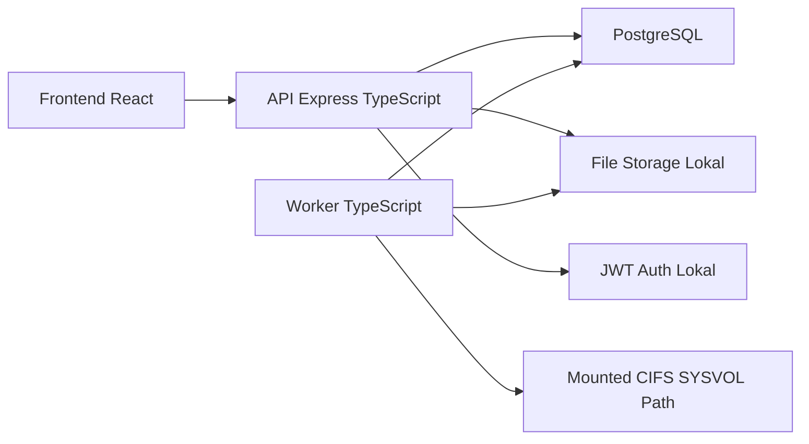
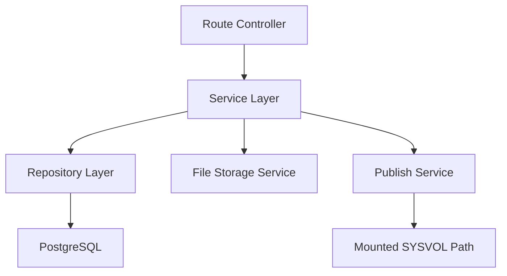
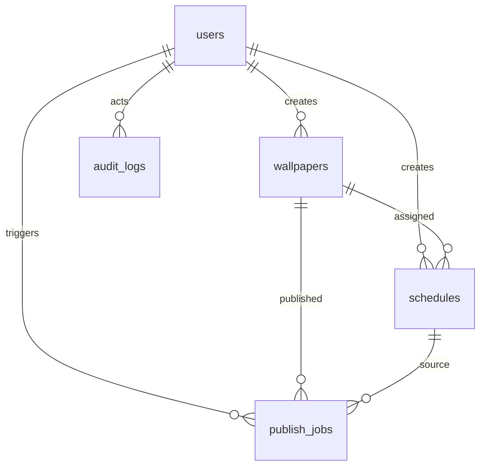

## 1. Desain Arsitektur


## 2. Deskripsi Teknologi
- Frontend: React 18 + TypeScript + Vite + Tailwind CSS + React Router + Zustand
- Backend API: Express + TypeScript + JWT + bcrypt
- Worker: Node.js TypeScript process untuk scheduler dan publisher
- Database: PostgreSQL
- ORM/Query: `pg` dengan SQL migration sederhana pada fase 1
- Upload handling: Multer
- Validation: Zod
- Testing: Vitest untuk logic unit, Supertest untuk API, dan script verifikasi untuk database
- Deployment: Docker Compose di Ubuntu dengan CIFS mount host ke container

## 3. Definisi Route
| Route | Tujuan |
|-------|--------|
| /login | Halaman autentikasi lokal |
| / | Dashboard operasional |
| /wallpapers | Manajemen wallpaper |
| /schedules | Manajemen jadwal |
| /publish | Histori publish dan manual publish |
| /settings | Konfigurasi runtime dan target publish |

## 4. Definisi API
```ts
type LoginRequest = {
  email: string
  password: string
}

type LoginResponse = {
  token: string
  user: {
    id: string
    email: string
    displayName: string
    role: "admin" | "operator"
  }
}

type Wallpaper = {
  id: string
  name: string
  description: string | null
  originalFilename: string
  mimeType: string
  fileSizeBytes: number
  checksumSha256: string
  status: "active" | "archived"
  createdAt: string
}

type Schedule = {
  id: string
  wallpaperId: string
  name: string
  startAt: string
  endAt: string | null
  timezone: string
  priority: number
  enabled: boolean
}

type PublishJob = {
  id: string
  status: "pending" | "running" | "success" | "failed"
  triggerType: "schedule" | "manual"
  wallpaperId: string
  scheduleId: string | null
  errorCode: string | null
  errorMessage: string | null
  createdAt: string
  finishedAt: string | null
}
```

Endpoint inti:
- `POST /api/auth/login`
- `GET /api/auth/me`
- `GET /api/wallpapers`
- `POST /api/wallpapers`
- `PATCH /api/wallpapers/:wallpaperId`
- `DELETE /api/wallpapers/:wallpaperId`
- `GET /api/schedules`
- `POST /api/schedules`
- `PATCH /api/schedules/:scheduleId`
- `DELETE /api/schedules/:scheduleId`
- `GET /api/publish/jobs`
- `GET /api/publish/status`
- `POST /api/publish/manual`
- `GET /api/config`
- `PATCH /api/config`
- `GET /api/health`

## 5. Diagram Arsitektur Server


## 6. Model Data
### 6.1 Definisi Model Data


### 6.2 Data Definition Language
```sql
create table if not exists users (
  id uuid primary key,
  email text unique not null,
  display_name text not null,
  password_hash text not null,
  role text not null,
  is_active boolean not null default true,
  created_at timestamptz not null default now(),
  updated_at timestamptz not null default now()
);

create table if not exists wallpapers (
  id uuid primary key,
  name text not null,
  description text,
  storage_path text not null,
  original_filename text not null,
  mime_type text not null,
  file_size_bytes bigint not null,
  checksum_sha256 text not null,
  width_px integer,
  height_px integer,
  status text not null default 'active',
  created_by uuid not null,
  created_at timestamptz not null default now(),
  updated_at timestamptz not null default now()
);

create table if not exists schedules (
  id uuid primary key,
  wallpaper_id uuid not null,
  name text not null,
  start_at_utc timestamptz not null,
  end_at_utc timestamptz,
  timezone text not null,
  priority integer not null default 100,
  enabled boolean not null default true,
  created_by uuid not null,
  created_at timestamptz not null default now(),
  updated_at timestamptz not null default now()
);

create table if not exists publish_jobs (
  id uuid primary key,
  trigger_type text not null,
  triggered_by uuid,
  wallpaper_id uuid not null,
  schedule_id uuid,
  status text not null,
  source_storage_path text not null,
  staging_target_path text,
  final_target_path text not null,
  attempt_count integer not null default 0,
  checksum_sha256 text,
  started_at timestamptz,
  finished_at timestamptz,
  error_code text,
  error_message text,
  created_at timestamptz not null default now()
);

create table if not exists audit_logs (
  id uuid primary key,
  actor_type text not null,
  actor_user_id uuid,
  action text not null,
  entity_type text not null,
  entity_id text not null,
  payload_json jsonb not null,
  created_at timestamptz not null default now()
);
```
